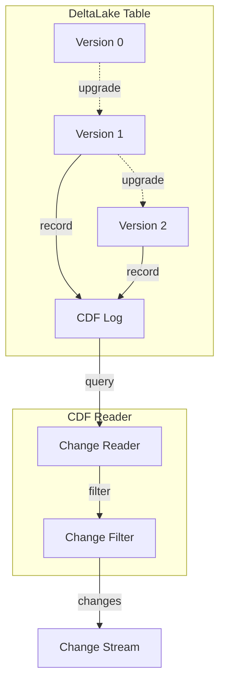
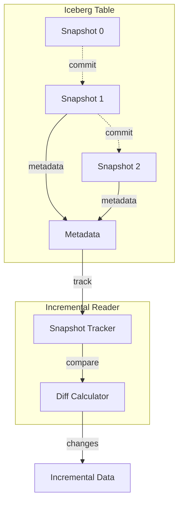

# CDC Demo Architecture

## System Overview

This project demonstrates Change Data Capture (CDC) implementations for multiple storage systems, showcasing real-time data replication and change tracking.

## High-Level Architecture

## Postgres CDC Pipeline (User Story 1)

### Component Diagram

### Data Flow

## MySQL CDC Pipeline (User Story 2)

## DeltaLake CDF Pipeline (User Story 3)

## Iceberg CDC Pipeline (User Story 4)

## Cross-Storage CDC Pipeline (User Story 5)

## Observability Stack

## Data Quality Framework

## Deployment Architecture

## Technology Stack

| Layer | Technology | Purpose |
|-------|------------|---------|
| **Source Databases** | PostgreSQL 15+, MySQL 8.0+ | Transactional data sources |
| **CDC Engine** | Debezium 2.x | Change data capture |
| **Message Queue** | Apache Kafka 3.x | Event streaming |
| **Processing** | Python 3.11+ | CDC pipeline orchestration |
| **Lakehouse** | DeltaLake, Apache Iceberg | Analytical storage |
| **Object Storage** | MinIO | S3-compatible storage |
| **Metrics** | Prometheus | Metrics collection |
| **Visualization** | Grafana | Dashboards and alerts |
| **Logging** | Loki | Log aggregation |
| **Testing** | pytest | Test framework |

## Network Ports

| Service | Port | Description |
|---------|------|-------------|
| PostgreSQL | 5432 | Database connection |
| MySQL | 3306 | Database connection |
| Kafka | 9092, 29092 | Kafka broker |
| Zookeeper | 2181 | Kafka coordination |
| Debezium | 8083 | Kafka Connect API |
| MinIO API | 9000 | S3-compatible API |
| MinIO Console | 9001 | Web UI |
| Prometheus | 9090 | Metrics API |
| Grafana | 3000 | Dashboard UI |
| Loki | 3100 | Log aggregation |
| Health Check | 8001 | Application health |
| Metrics Export | 8000 | Prometheus exporter |

## Security Considerations

1. **Database Credentials**: Stored in `.env` file (not committed to git)
2. **Kafka Security**: No authentication (demo environment only)
3. **Network Isolation**: All services in Docker bridge network
4. **MinIO**: Default credentials (change in production)
5. **Grafana**: Default admin credentials (change in production)

## Scalability

### Horizontal Scaling
- **Kafka**: Add more brokers and partitions
- **Debezium**: Run multiple connector tasks
- **Consumers**: Deploy multiple pipeline instances with consumer groups

### Vertical Scaling
- **Batch Size**: Increase for higher throughput
- **Spark**: Add more executors and memory
- **Database**: Tune connection pools and resources

## Future Enhancements

1. **Authentication**: Add Kafka SASL/SSL
2. **Encryption**: Enable TLS for all connections
3. **Schema Registry**: Add Confluent Schema Registry
4. **Monitoring**: Add distributed tracing with Jaeger
5. **CI/CD**: Automated testing and deployment pipelines
