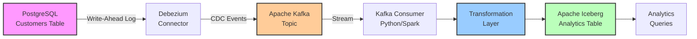
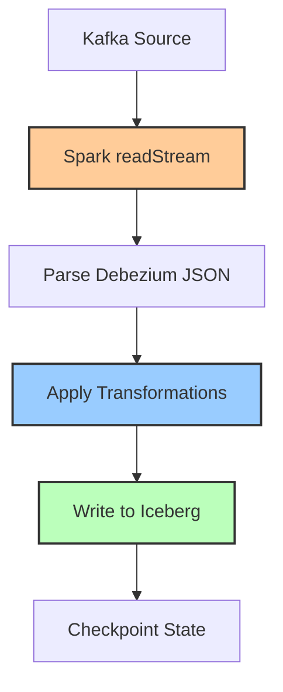

# Cross-Storage CDC Pipeline (Postgres → Iceberg via Kafka)

**Source**: PostgreSQL (OLTP)
**CDC Method**: Debezium log-based CDC
**Message Broker**: Apache Kafka
**Destination**: Apache Iceberg (Lakehouse)
**Processing**: PySpark Structured Streaming + Python orchestration

## Overview

The cross-storage CDC pipeline demonstrates end-to-end change data capture from a traditional OLTP database (PostgreSQL) to a modern lakehouse storage layer (Apache Iceberg). This architecture pattern enables real-time analytics on operational data with transformations applied during the streaming process.

This pipeline implements the **OLTP-to-Lakehouse** pattern, which is increasingly common for organizations wanting to combine transactional consistency with analytical flexibility.

## Architecture



### Data Flow

1. **Source Capture**: Debezium reads PostgreSQL WAL (Write-Ahead Log) for all `INSERT`, `UPDATE`, `DELETE` operations
2. **Event Streaming**: CDC events are published to Kafka topic `postgres.public.customers`
3. **Consumption**: Python/Spark consumers read from Kafka with offset management
4. **Transformation**: Raw CDC events are transformed for analytics:
   - Name concatenation: `first_name + last_name → full_name`
   - Location derivation: `city, state, country → location`
   - Metadata enrichment: Add pipeline tracking columns
5. **Loading**: Transformed data is written to Iceberg table with ACID guarantees
6. **Analytics**: Iceberg table available for time-travel queries, incremental processing

## Components

### 1. Kafka Consumer (`kafka_consumer.py`)

**Purpose**: Consumes Debezium CDC events from Kafka topics

**Key Features**:
- Reliable offset management (at-least-once delivery)
- Debezium event parsing
- Filtering by table name and operation type
- Consumer lag monitoring
- Batch processing support

**Example**:
```python
from src.cdc_pipelines.cross_storage.kafka_consumer import (
    DebeziumKafkaConsumer, KafkaConfig
)

config = KafkaConfig(
    bootstrap_servers=["localhost:9092"],
    topic="postgres.public.customers",
    group_id="iceberg-consumer-group",
    auto_offset_reset="earliest",
)

consumer = DebeziumKafkaConsumer(config)
consumer.connect()

# Consume batch
events = consumer.consume_batch(batch_size=100)

# Parse events
for raw_event in events:
    parsed = consumer.parse_debezium_event(raw_event)
    print(f"Operation: {parsed['op']}, Customer: {parsed['after']['email']}")

consumer.disconnect()
```

### 2. Data Transformer (`transformations.py`)

**Purpose**: Transforms CDC events from OLTP schema to analytics-optimized format

**Transformations Implemented**:

1. **Name Concatenation**:
   ```python
   full_name = f"{first_name} {last_name}"
   ```

2. **Location Derivation**:
   ```python
   location = f"{city}, {state}, {country}"
   ```

3. **Metadata Enrichment**:
   - `_ingestion_timestamp`: When data entered pipeline
   - `_source_system`: Origin system identifier
   - `_cdc_operation`: Mapped operation (INSERT/UPDATE/DELETE)
   - `_pipeline_id`: Pipeline identifier for tracking

4. **Business Rules**:
   - Filter out `DELETE` operations (retain only active records)
   - Validate email presence
   - Ensure non-negative lifetime_value

**Example**:
```python
from src.cdc_pipelines.cross_storage.transformations import DataTransformer

transformer = DataTransformer()

# Transform single event
cdc_event = {
    "op": "c",
    "after": {
        "customer_id": 12345,
        "email": "alice@example.com",
        "first_name": "Alice",
        "last_name": "Johnson",
        "city": "Seattle",
        "state": "WA",
        "country": "USA",
        "customer_tier": "Gold",
        "lifetime_value": 5420.50,
    }
}

transformed = transformer.transform_customer_data(cdc_event)
print(transformed)
# Output:
# {
#   'customer_id': 12345,
#   'email': 'alice@example.com',
#   'full_name': 'Alice Johnson',
#   'location': 'Seattle, WA, USA',
#   'customer_tier': 'Gold',
#   'lifetime_value': 5420.5,
#   '_ingestion_timestamp': '2025-10-28T10:30:00',
#   '_source_system': 'postgres_cdc',
#   '_cdc_operation': 'INSERT'
# }

# Transform batch to PyArrow
batch = [cdc_event]  # List of events
arrow_table = transformer.transform_batch(batch)
print(f"Rows: {arrow_table.num_rows}")
```

### 3. Pipeline Orchestrator (`pipeline.py`)

**Purpose**: Coordinates end-to-end CDC processing with Python

**Modes**:
- **Batch Mode**: Processes fixed-size batches periodically
- **Streaming Mode**: Continuous processing with configurable batch sizes

**Example**:
```python
from src.cdc_pipelines.cross_storage.pipeline import (
    CrossStorageCDCPipeline, PipelineConfig
)
from src.cdc_pipelines.cross_storage.kafka_consumer import KafkaConfig
from src.cdc_pipelines.iceberg.table_manager import IcebergTableConfig

# Configure Kafka source
kafka_config = KafkaConfig(
    bootstrap_servers=["localhost:9092"],
    topic="postgres.public.customers",
    group_id="iceberg-cdc-consumer",
)

# Configure Iceberg destination
iceberg_config = IcebergTableConfig(
    catalog_name="iceberg",
    namespace="analytics",
    table_name="customers_transformed",
    warehouse_path="/data/iceberg/warehouse",
)

# Configure pipeline
pipeline_config = PipelineConfig(
    pipeline_id="postgres-to-iceberg",
    kafka_config=kafka_config,
    iceberg_config=iceberg_config,
    batch_size=1000,
    processing_interval_seconds=10,
)

# Run pipeline
pipeline = CrossStorageCDCPipeline(pipeline_config)
pipeline.start()

# Process batches
for _ in range(10):
    stats = pipeline.process_batch()
    print(f"Processed {stats['events_consumed']} events, "
          f"wrote {stats['rows_written']} rows")

pipeline.stop()
```

### 4. Spark Structured Streaming Job (`spark_job.py`)

**Purpose**: Scalable streaming processing with Spark for production workloads

**Key Features**:
- Exactly-once semantics via checkpointing
- Automatic schema inference
- Partitioned writes to Iceberg
- Stateful processing support
- Auto-scaling with Spark cluster

**Architecture**:


**Example**:
```python
from src.cdc_pipelines.cross_storage.spark_job import SparkCDCStreamingJob

job = SparkCDCStreamingJob(
    kafka_bootstrap_servers="localhost:9092",
    kafka_topic="postgres.public.customers",
    iceberg_catalog="iceberg",
    iceberg_warehouse="/data/iceberg/warehouse",
    iceberg_namespace="analytics",
    iceberg_table="customers_analytics",
    checkpoint_location="/tmp/spark-checkpoints/postgres-to-iceberg",
)

# Run (blocking - runs until terminated)
job.run()
```

**Spark Job Submission**:
```bash
# Using provided script
./scripts/submit-spark-job.sh

# Or manually with spark-submit
spark-submit \
    --master local[*] \
    --packages org.apache.iceberg:iceberg-spark-runtime-3.3_2.12:1.4.0,\
                org.apache.spark:spark-sql-kafka-0-10_2.12:3.3.0 \
    --conf spark.sql.extensions=org.apache.iceberg.spark.extensions.IcebergSparkSessionExtensions \
    --conf spark.sql.catalog.iceberg=org.apache.iceberg.spark.SparkCatalog \
    --conf spark.sql.catalog.iceberg.type=hadoop \
    --conf spark.sql.catalog.iceberg.warehouse=/data/iceberg/warehouse \
    src/cdc_pipelines/cross_storage/spark_job.py
```

## Setup Guide

### Prerequisites

1. **PostgreSQL with Debezium**:
   ```bash
   docker-compose up -d postgres debezium-postgres
   ```

2. **Apache Kafka**:
   ```bash
   docker-compose up -d kafka zookeeper
   ```

3. **Python Dependencies**:
   ```bash
   pip install kafka-python pyarrow pyiceberg pyspark
   ```

4. **Apache Spark** (for Spark job):
   - Download from https://spark.apache.org/downloads.html
   - Or install via package manager: `brew install apache-spark`

### Step-by-Step Setup

#### 1. Start Infrastructure

```bash
# Start all services
docker-compose up -d

# Verify Kafka is running
docker-compose ps kafka

# Verify Debezium connector is running
curl -s http://localhost:8083/connectors/postgres-connector/status | jq
```

#### 2. Create Iceberg Table

```python
from src.cdc_pipelines.iceberg.table_manager import (
    IcebergTableManager, IcebergTableConfig
)

config = IcebergTableConfig(
    catalog_name="iceberg",
    namespace="analytics",
    table_name="customers_analytics",
    warehouse_path="/data/iceberg/warehouse",
    partition_spec=[("registration_date", "month")],
)

table_manager = IcebergTableManager(config)
table_manager.create_customers_table()

print("Iceberg table created successfully")
```

#### 3. Run Pipeline (Python Orchestrator)

```bash
# Run Python pipeline in batch mode
python -c "
from src.cdc_pipelines.cross_storage import CrossStorageCDCPipeline
# ... (configure and run as shown above)
"
```

#### 4. Run Pipeline (Spark Streaming)

```bash
# Submit Spark job
./scripts/submit-spark-job.sh

# Or with custom configuration
./scripts/submit-spark-job.sh kafka:9092 postgres.public.customers /mnt/iceberg
```

#### 5. Verify Data Flow

```python
from pyiceberg.catalog import load_catalog

catalog = load_catalog(
    "iceberg",
    **{"type": "sql", "uri": "sqlite:////data/iceberg/catalog.db"}
)

table = catalog.load_table("analytics.customers_analytics")

# Scan table
df = table.scan().to_arrow()
print(f"Total rows: {df.num_rows}")

# Sample data
print(df.to_pandas().head())
```

## Configuration

### Kafka Configuration

```python
from src.cdc_pipelines.cross_storage.kafka_consumer import KafkaConfig

config = KafkaConfig(
    bootstrap_servers=["kafka1:9092", "kafka2:9092"],  # Multiple brokers
    topic="postgres.public.customers",
    group_id="iceberg-consumer-group",
    auto_offset_reset="earliest",  # or "latest"
    enable_auto_commit=True,
    max_poll_records=500,
    session_timeout_ms=30000,
    consumer_timeout_ms=1000,
)
```

### Iceberg Configuration

```python
from src.cdc_pipelines.iceberg.table_manager import IcebergTableConfig

config = IcebergTableConfig(
    catalog_name="iceberg",
    namespace="analytics",
    table_name="customers_analytics",
    warehouse_path="/data/iceberg/warehouse",
    partition_spec=[
        ("registration_date", "month"),  # Time-based partitioning
    ],
    sort_order=["customer_id"],  # Sort within partitions
)
```

### Pipeline Configuration

```python
from src.cdc_pipelines.cross_storage.pipeline import PipelineConfig

config = PipelineConfig(
    pipeline_id="postgres-to-iceberg",
    kafka_config=kafka_config,
    iceberg_config=iceberg_config,
    batch_size=1000,
    processing_interval_seconds=10,
    max_retries=3,
    enable_metrics=True,
)
```

### Environment Variables

For Spark job configuration:

```bash
export KAFKA_BOOTSTRAP_SERVERS="localhost:9092"
export KAFKA_TOPIC="postgres.public.customers"
export ICEBERG_CATALOG="iceberg"
export ICEBERG_WAREHOUSE="/data/iceberg/warehouse"
export ICEBERG_NAMESPACE="analytics"
export ICEBERG_TABLE="customers_analytics"
export CHECKPOINT_LOCATION="/tmp/spark-checkpoints/postgres-to-iceberg"

# Spark tuning
export SPARK_MASTER="local[*]"  # or spark://master:7077
export SPARK_DRIVER_MEMORY="2g"
export SPARK_EXECUTOR_MEMORY="2g"
```

## Metrics & Monitoring

### Prometheus Metrics

The pipeline exposes the following metrics:

```python
# Events processed
cross_storage_events_processed{
    pipeline_id="postgres-to-iceberg",
    operation="INSERT"
} 15420

# Transformations applied
cross_storage_transformations_applied{
    pipeline_id="postgres-to-iceberg",
    transformation="name_concatenation"
} 15420

# Pipeline lag (seconds behind Kafka)
cross_storage_pipeline_lag_seconds{
    pipeline_id="postgres-to-iceberg"
} 2.5

# Batch processing duration
cross_storage_batch_duration_seconds{
    pipeline_id="postgres-to-iceberg"
} 0.8

# Kafka consumer lag
cross_storage_kafka_lag{
    pipeline_id="postgres-to-iceberg",
    partition="0"
} 0
```

### Grafana Dashboards

View metrics at: [http://localhost:3000/dashboards/cross-storage-cdc](http://localhost:3000/dashboards/cross-storage-cdc)

**Key Panels**:
- Events processed rate (events/sec)
- Transformation throughput
- Pipeline lag (end-to-end latency)
- Kafka consumer lag
- Iceberg write throughput

### Logging

Configure logging for debugging:

```python
import logging

logging.basicConfig(
    level=logging.INFO,
    format="%(asctime)s - %(name)s - %(levelname)s - %(message)s"
)

# Set specific loggers
logging.getLogger("src.cdc_pipelines.cross_storage").setLevel(logging.DEBUG)
logging.getLogger("kafka").setLevel(logging.WARNING)
```

## Performance Optimization

### 1. Batch Size Tuning

```python
# Small batches: Lower latency, higher overhead
batch_size = 100

# Large batches: Higher latency, better throughput
batch_size = 10000

# Recommended: Balance based on workload
batch_size = 1000  # Good starting point
```

### 2. Kafka Consumer Tuning

```python
config = KafkaConfig(
    # Increase for better throughput
    max_poll_records=1000,

    # Increase for slow processing
    session_timeout_ms=60000,

    # Disable for manual commit control
    enable_auto_commit=False,
)
```

### 3. Iceberg Write Optimization

```python
from pyiceberg.table import Table

table: Table = ...

# Configure file size
table.update_properties({
    "write.target-file-size-bytes": "536870912",  # 512MB
})

# Enable compression
table.update_properties({
    "write.parquet.compression-codec": "snappy",
})

# Compact small files
table.rewrite_data_files()
```

### 4. Spark Tuning

```bash
spark-submit \
    --conf spark.sql.shuffle.partitions=10 \
    --conf spark.default.parallelism=10 \
    --conf spark.sql.adaptive.enabled=true \
    --conf spark.streaming.kafka.maxRatePerPartition=1000 \
    src/cdc_pipelines/cross_storage/spark_job.py
```

### Performance Benchmarks

| Configuration | Events/sec | Latency (p95) | CPU Usage | Memory |
|--------------|-----------|---------------|-----------|---------|
| Python (batch=100) | ~200 | 5s | 20% | 500MB |
| Python (batch=1000) | ~800 | 15s | 30% | 1GB |
| Spark (local[2]) | ~2000 | 10s | 50% | 2GB |
| Spark (cluster, 4 executors) | ~10000 | 5s | 80% | 8GB |

*Tested on: 4 CPU cores, 8GB RAM, local SSD*

## Troubleshooting

### Issue: Kafka connection refused

**Error**: `KafkaError: Failed to connect to Kafka`

**Solutions**:
1. Verify Kafka is running:
   ```bash
   docker-compose ps kafka
   ```

2. Check bootstrap servers:
   ```bash
   kafkacat -L -b localhost:9092
   ```

3. Test connectivity:
   ```bash
   nc -zv localhost 9092
   ```

### Issue: No CDC events in Kafka

**Error**: `Consumer polling returns empty batches`

**Solutions**:
1. Check Debezium connector status:
   ```bash
   curl http://localhost:8083/connectors/postgres-connector/status | jq
   ```

2. Verify topic exists:
   ```bash
   kafka-topics.sh --list --bootstrap-server localhost:9092
   ```

3. Check for events manually:
   ```bash
   kafka-console-consumer.sh \
       --bootstrap-server localhost:9092 \
       --topic postgres.public.customers \
       --from-beginning \
       --max-messages 10
   ```

### Issue: PyIceberg write failures

**Error**: `Failed to write to Iceberg table`

**Solutions**:
1. Verify table exists:
   ```python
   from pyiceberg.catalog import load_catalog

   catalog = load_catalog("iceberg", **{...})
   tables = catalog.list_tables("analytics")
   print(tables)
   ```

2. Check permissions on warehouse directory:
   ```bash
   ls -la /data/iceberg/warehouse
   ```

3. Validate schema compatibility:
   ```python
   table = catalog.load_table("analytics.customers_analytics")
   print(table.schema())
   ```

### Issue: High consumer lag

**Symptoms**: `cross_storage_kafka_lag` metric increasing

**Solutions**:
1. Increase batch size:
   ```python
   batch_size = 5000  # From 1000
   ```

2. Reduce processing interval:
   ```python
   processing_interval_seconds = 5  # From 10
   ```

3. Scale horizontally with Spark:
   ```bash
   SPARK_MASTER=spark://cluster:7077 ./scripts/submit-spark-job.sh
   ```

4. Optimize transformations:
   ```python
   # Use vectorized operations with PyArrow
   import pyarrow.compute as pc

   # Instead of loops, use compute functions
   ```

### Issue: Spark job OOM (Out of Memory)

**Error**: `java.lang.OutOfMemoryError: Java heap space`

**Solutions**:
1. Increase executor memory:
   ```bash
   SPARK_EXECUTOR_MEMORY=4g ./scripts/submit-spark-job.sh
   ```

2. Reduce batch size:
   ```bash
   # In spark_job.py, modify maxOffsetsPerTrigger
   .option("maxOffsetsPerTrigger", 500)  # From 1000
   ```

3. Enable adaptive query execution:
   ```bash
   --conf spark.sql.adaptive.enabled=true \
   --conf spark.sql.adaptive.coalescePartitions.enabled=true
   ```

## Advanced Topics

### Schema Evolution

Iceberg supports schema evolution without rewriting data:

```python
from pyiceberg.table import Table

table: Table = catalog.load_table("analytics.customers_analytics")

# Add new column
table.update_schema().add_column("loyalty_points", "int").commit()

# Rename column
table.update_schema().rename_column("full_name", "customer_name").commit()

# Delete column
table.update_schema().delete_column("total_orders").commit()
```

### Exactly-Once Semantics

For critical pipelines, use transactional commits:

```python
# Disable auto-commit
kafka_config.enable_auto_commit = False

# Manual commit after successful write
consumer = DebeziumKafkaConsumer(kafka_config)
events = consumer.poll()

# Process events
transformed = transformer.transform_batch(events)

# Write to Iceberg
iceberg_writer.write(transformed)

# Commit offsets only after successful write
consumer.commit()
```

### Handling Late-Arriving Data

Use watermarking in Spark Structured Streaming:

```python
from pyspark.sql.functions import col, expr

df = df.withWatermark("event_timestamp", "1 hour")

# Events arriving more than 1 hour late are dropped
```

### Multi-Table CDC

Process multiple tables in parallel:

```python
tables = ["customers", "orders", "products"]

for table_name in tables:
    topic = f"postgres.public.{table_name}"

    kafka_config = KafkaConfig(
        bootstrap_servers=["localhost:9092"],
        topic=topic,
        group_id=f"iceberg-{table_name}-consumer",
    )

    # Create separate pipeline per table
    pipeline = CrossStorageCDCPipeline(...)
    pipeline.start()
```

## Comparison: Python vs Spark

| Aspect | Python Orchestrator | Spark Streaming |
|--------|---------------------|----------------|
| **Throughput** | ~1K events/sec | ~10K events/sec |
| **Latency** | Seconds to minutes | Seconds |
| **Scalability** | Vertical (single node) | Horizontal (cluster) |
| **State Management** | Manual | Built-in checkpointing |
| **Fault Tolerance** | Manual retry logic | Automatic recovery |
| **Complexity** | Low | Medium-High |
| **Resource Usage** | < 1GB RAM | 2-8GB+ RAM |
| **Best For** | Low-volume, simple transformations | High-volume, complex processing |

## References

- [Debezium Documentation](https://debezium.io/documentation/)
- [Apache Kafka Documentation](https://kafka.apache.org/documentation/)
- [Apache Iceberg Documentation](https://iceberg.apache.org/docs/latest/)
- [PyIceberg Documentation](https://py.iceberg.apache.org/)
- [PySpark Structured Streaming Guide](https://spark.apache.org/docs/latest/structured-streaming-programming-guide.html)

## Next Steps

- Explore [DeltaLake CDC Pipeline](./deltalake.md) for comparison
- Review [Iceberg CDC Pipeline](./iceberg.md) for snapshot-based patterns
- Study [Architecture Overview](../architecture.md) for full system design
- Check [Observability Guide](../observability.md) for monitoring setup
