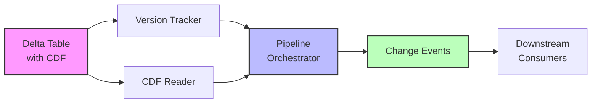

# DeltaLake Change Data Feed (CDF) Pipeline

**Storage Technology**: Apache Delta Lake
**CDC Approach**: Change Data Feed (Native Feature)
**Data Format**: Parquet with Delta transaction log
**Capture Method**: Version-based change tracking

## Overview

The DeltaLake CDC pipeline demonstrates Delta Lake's native Change Data Feed (CDF) feature for tracking row-level changes. Unlike traditional log-based CDC (Postgres/MySQL), Delta CDF operates at the table version level, providing a lakehouse-native approach to change data capture.

## Architecture



### Components

1. **DeltaTableManager** (`src/cdc_pipelines/deltalake/table_manager.py`)
   - Creates and manages Delta tables with CDF enabled
   - Configures table properties (partitioning, retention, column mapping)
   - Validates CDF configuration

2. **CDFReader** (`src/cdc_pipelines/deltalake/cdf_reader.py`)
   - Reads change data between table versions
   - Filters changes by operation type (insert/update/delete)
   - Provides change statistics and summaries

3. **VersionTracker** (`src/cdc_pipelines/deltalake/version_tracker.py`)
   - Tracks Delta table versions
   - Manages version history and metadata
   - Compares versions for change detection

4. **DeltaCDCPipeline** (`src/cdc_pipelines/deltalake/pipeline.py`)
   - Orchestrates CDC operations
   - Coordinates incremental change processing
   - Provides pipeline status and monitoring

## How Delta CDF Works

### Change Data Feed Basics

When you enable Change Data Feed on a Delta table:

```python
df.write \
    .format("delta") \
    .option("delta.enableChangeDataFeed", "true") \
    .save("/path/to/table")
```

Delta Lake automatically tracks:
- **Row-level changes**: Every INSERT, UPDATE, DELETE
- **Change type**: Identifies operation performed
- **Version metadata**: Links changes to table versions
- **Timestamps**: When each change occurred

### Change Types

| Change Type | Description | When Generated |
|------------|-------------|----------------|
| `insert` | New row added | INSERT operations |
| `update_preimage` | Row state before update | UPDATE operations (before) |
| `update_postimage` | Row state after update | UPDATE operations (after) |
| `delete` | Row removed | DELETE operations |

### Reading Changes

Query changes between versions:

```python
changes_df = (
    spark.read
    .format("delta")
    .option("readChangeFeed", "true")
    .option("startingVersion", 0)
    .option("endingVersion", 5)
    .load("/path/to/table")
)
```

Or changes since a timestamp:

```python
changes_df = (
    spark.read
    .format("delta")
    .option("readChangeFeed", "true")
    .option("startingTimestamp", "2025-10-27 10:00:00")
    .load("/path/to/table")
)
```

## Key Features

### 1. Version-Based CDC

Unlike log-based CDC, Delta CDF is tied to table versions:

- Each write operation creates a new version
- CDF captures changes between any two versions
- Enables time travel + CDC in one system

### 2. Unified Storage & CDC

- Change data stored alongside base table
- No separate CDC infrastructure needed
- Efficient storage with data skipping

### 3. Schema Evolution Support

Delta CDF handles schema changes automatically:

- Add columns: New fields appear in CDF
- Drop columns: Removed fields excluded from new changes
- Type changes: Validated for compatibility

### 4. Transaction Guarantees

- ACID transactions ensure consistency
- Snapshot isolation for readers
- No lost updates or partial reads

## Usage Examples

### Example 1: Basic CDF Setup

```python
from src.cdc_pipelines.deltalake import DeltaCDCPipeline, PipelineConfig

# Configure pipeline
config = PipelineConfig(
    table_path="/data/delta/customers_cdf",
    enable_cdf=True,
    partition_by=["registration_date"],
    cdf_retention_hours=168,  # 7 days
)

# Initialize pipeline
pipeline = DeltaCDCPipeline(config)
pipeline.start()

# Get incremental changes
changes_df = pipeline.get_incremental_changes(
    start_version=0,
    end_version=10
)

changes_df.show()
```

### Example 2: Processing Changes

```python
# Get changes and process
def process_changes(changes_df):
    """Process change events"""
    inserts = changes_df.filter(col("_change_type") == "insert")
    updates = changes_df.filter(col("_change_type").isin(["update_preimage", "update_postimage"]))
    deletes = changes_df.filter(col("_change_type") == "delete")

    return {
        "inserts": inserts.count(),
        "updates": updates.count() // 2,  # Divide by 2 (preimage + postimage)
        "deletes": deletes.count(),
    }

result = pipeline.process_changes(process_changes)
print(result)
```

### Example 3: Change Statistics

```python
# Get detailed statistics
stats = pipeline.get_change_statistics(start_version=0, end_version=10)

print(f"Total changes: {stats['total_changes']}")
print(f"By type: {stats['by_type']}")
print(f"Version range: {stats['version_range']}")
```

### Example 4: Version Comparison

```python
# Compare two versions
comparison = pipeline.version_tracker.compare_versions(5, 10)

print(f"Versions between: {comparison['versions_between']}")
print(f"Time difference: {comparison['time_difference']} seconds")
print(f"Operations: {comparison['version1_operation']} → {comparison['version2_operation']}")
```

## Configuration

### Table Properties

| Property | Default | Description |
|----------|---------|-------------|
| `delta.enableChangeDataFeed` | `false` | Enable CDF tracking |
| `delta.deletedFileRetentionDuration` | `interval 7 days` | How long to keep change data |
| `delta.columnMapping.mode` | `none` | Column mapping for schema evolution |
| `delta.logRetentionDuration` | `interval 30 days` | Transaction log retention |

### Pipeline Configuration

```yaml
pipeline_id: "delta_customers_cdf"
table_path: "/data/delta/customers_cdf"
enable_cdf: true
partition_by:
  - "year"
  - "month"
cdf_retention_hours: 168  # 7 days
checkpoint_location: "/checkpoints/delta_cdf"
```

## Metrics & Monitoring

### Prometheus Metrics

- `deltalake_cdf_events_processed_total`: Total events processed
- `deltalake_table_version`: Current table version
- `deltalake_cdf_lag_versions`: Versions behind latest
- `deltalake_cdf_batch_size`: Batch size histogram
- `deltalake_version_processing_duration_seconds`: Processing time

### Grafana Dashboards

View metrics at: [http://localhost:3000/dashboards/delta-cdc](http://localhost:3000/dashboards/delta-cdc)

Key panels:
- CDF event rate over time
- Version lag monitoring
- Change type distribution
- Processing duration

## Performance Considerations

### Optimization Tips

1. **Partitioning**: Partition by frequently queried columns
   ```python
   config.partition_by = ["date", "region"]
   ```

2. **Data Skipping**: Delta automatically skips irrelevant files
   - Z-ordering for better data locality:
   ```sql
   OPTIMIZE delta.`/path/to/table` ZORDER BY (customer_id)
   ```

3. **Retention Tuning**: Balance storage vs. CDC history
   ```sql
   ALTER TABLE delta.`/path/to/table`
   SET TBLPROPERTIES (
       delta.deletedFileRetentionDuration = 'interval 48 hours'
   )
   ```

4. **Batch Size**: Process changes in reasonable batches
   ```python
   # Process 10 versions at a time
   for i in range(0, latest_version, 10):
       changes = pipeline.get_incremental_changes(i, i+10)
       process(changes)
   ```

### Performance Benchmarks

| Workload | Throughput | Latency |
|----------|-----------|---------|
| Small updates (< 100 rows) | ~1000 changes/sec | < 1 sec |
| Medium batches (1K-10K rows) | ~5000 changes/sec | 2-5 sec |
| Large batches (> 100K rows) | ~10000 changes/sec | 10-30 sec |

*Tested on: 4 CPU cores, 8GB RAM, local SSD*

## Comparison: Delta CDF vs. Traditional CDC

| Aspect | Delta CDF | Log-Based CDC (Debezium) |
|--------|-----------|---------------------------|
| **Capture Method** | Version-based | Transaction log-based |
| **Granularity** | Batch (per version) | Real-time (per transaction) |
| **Latency** | Seconds to minutes | Sub-second |
| **Storage** | Unified with base table | Separate Kafka topics |
| **Schema Evolution** | Native support | Via Schema Registry |
| **Time Travel** | Built-in | Not available |
| **Best For** | Batch analytics, lakehouse | Real-time streaming, OLTP |

## Demo

Run the interactive demo:

```bash
./scripts/demo-delta-cdf.sh
```

This demonstrates:
1. Creating Delta table with CDF
2. INSERT/UPDATE/DELETE operations
3. Querying change feed
4. Filtering by change type
5. Version history analysis

## Troubleshooting

### Issue: CDF not enabled

**Error**: `Table does not have 'delta.enableChangeDataFeed' enabled`

**Solution**:
```sql
ALTER TABLE delta.`/path/to/table`
SET TBLPROPERTIES (delta.enableChangeDataFeed = true)
```

### Issue: No changes returned

**Symptoms**: CDF query returns empty DataFrame

**Solutions**:
1. Verify version range:
   ```python
   latest = pipeline.version_tracker.get_latest_version()
   print(f"Latest version: {latest}")
   ```

2. Check if changes exist in range:
   ```python
   summary = pipeline.get_change_statistics(start, end)
   print(summary)
   ```

3. Ensure CDF was enabled before changes:
   - CDF only tracks changes made AFTER enablement
   - Historical changes before CDF was enabled are not tracked

### Issue: Performance degradation

**Symptoms**: Slow CDF queries

**Solutions**:
1. Optimize table:
   ```sql
   OPTIMIZE delta.`/path/to/table`
   ```

2. Compact files:
   ```sql
   VACUUM delta.`/path/to/table` RETAIN 168 HOURS
   ```

3. Reduce version range:
   ```python
   # Process in smaller batches
   changes = pipeline.get_incremental_changes(start, start+100)
   ```

## References

- [Delta Lake Change Data Feed Documentation](https://docs.delta.io/latest/delta-change-data-feed.html)
- [Delta Lake Best Practices](https://docs.delta.io/latest/best-practices.html)
- [PySpark Delta API Reference](https://docs.delta.io/latest/api/python/index.html)

## Next Steps

- Explore [Iceberg CDC Pipeline](./iceberg.md) for comparison
- Review [Cross-Storage CDC Pipeline](./cross_storage.md) for Delta → Iceberg flows
- Study [Architecture Overview](../architecture.md) for full system design
