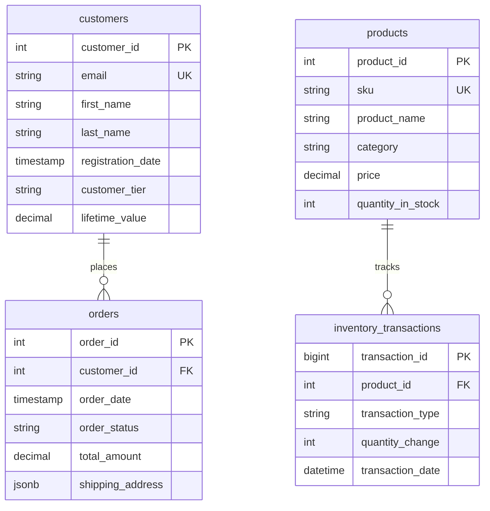

# Data Model: CDC Demo for Open-Source Data Storage

**Date**: 2025-10-27
**Feature**: CDC Demo for Open-Source Data Storage
**Purpose**: Define data structures and entities for CDC pipelines, mock data, and validation

## Overview

This document defines the data model for the CDC demonstration project. The model covers:
1. **Source Data Schemas** - Mock data structures for Postgres and MySQL source databases
2. **CDC Event Schema** - Standardized change event format
3. **Destination Schemas** - DeltaLake and Iceberg table structures
4. **Metadata Schemas** - Pipeline configuration, validation results, metrics

## 1. Source Database Schemas

### 1.1 PostgreSQL Source Tables

#### Table: `customers`

Represents customer master data for CDC demonstration.

| Column Name | Data Type | Constraints | Description |
|------------|-----------|-------------|-------------|
| customer_id | SERIAL | PRIMARY KEY | Auto-incrementing customer identifier |
| email | VARCHAR(255) | UNIQUE, NOT NULL | Customer email address |
| first_name | VARCHAR(100) | NOT NULL | Customer first name |
| last_name | VARCHAR(100) | NOT NULL | Customer last name |
| phone | VARCHAR(20) | NULL | Customer phone number |
| address_line1 | VARCHAR(255) | NULL | Street address |
| city | VARCHAR(100) | NULL | City |
| state | VARCHAR(50) | NULL | State/province |
| postal_code | VARCHAR(20) | NULL | Postal/ZIP code |
| country | VARCHAR(100) | NOT NULL | Country (default 'USA') |
| registration_date | TIMESTAMP | NOT NULL | Account registration timestamp |
| last_updated | TIMESTAMP | NOT NULL | Last update timestamp (for CDC) |
| is_active | BOOLEAN | DEFAULT TRUE | Account active status |
| customer_tier | VARCHAR(20) | NULL | Loyalty tier (Bronze/Silver/Gold/Platinum) |
| lifetime_value | NUMERIC(12,2) | DEFAULT 0.00 | Total lifetime purchase value |

**Indexes**:
- PRIMARY KEY on customer_id
- UNIQUE INDEX on email
- INDEX on last_updated (for timestamp-based CDC)
- INDEX on is_active (for filtering)

#### Table: `orders`

Represents purchase orders with foreign key to customers.

| Column Name | Data Type | Constraints | Description |
|------------|-----------|-------------|-------------|
| order_id | SERIAL | PRIMARY KEY | Auto-incrementing order identifier |
| customer_id | INTEGER | FOREIGN KEY → customers(customer_id), NOT NULL | Customer reference |
| order_date | TIMESTAMP | NOT NULL | Order placement timestamp |
| order_status | VARCHAR(50) | NOT NULL | Status (pending/processing/shipped/delivered/cancelled) |
| total_amount | NUMERIC(12,2) | NOT NULL | Total order amount |
| shipping_address | JSONB | NULL | Shipping address (JSON for schema evolution demo) |
| payment_method | VARCHAR(50) | NULL | Payment method type |
| order_notes | TEXT | NULL | Customer notes on order |
| last_updated | TIMESTAMP | NOT NULL | Last update timestamp (for CDC) |

**Indexes**:
- PRIMARY KEY on order_id
- INDEX on customer_id (foreign key)
- INDEX on order_date (range queries)
- INDEX on order_status (filtering)
- GIN INDEX on shipping_address (JSONB queries)

#### Table: `cdc_schema_evolution_test`

Special table for schema evolution testing.

| Column Name | Data Type | Constraints | Description |
|------------|-----------|-------------|-------------|
| id | SERIAL | PRIMARY KEY | Row identifier |
| original_column | VARCHAR(255) | NOT NULL | Column present from start |
| created_at | TIMESTAMP | NOT NULL | Creation timestamp |

**Schema Evolution Steps (for testing)**:
1. Initial state: 3 columns (id, original_column, created_at)
2. Step 1: ADD COLUMN new_column_added VARCHAR(100)
3. Step 2: DROP COLUMN original_column
4. Step 3: ALTER COLUMN new_column_added TYPE TEXT
5. Step 4: RENAME COLUMN new_column_added TO renamed_column

### 1.2 MySQL Source Tables

#### Table: `products`

Represents product catalog.

| Column Name | Data Type | Constraints | Description |
|------------|-----------|-------------|-------------|
| product_id | INT | PRIMARY KEY AUTO_INCREMENT | Product identifier |
| sku | VARCHAR(100) | UNIQUE, NOT NULL | Stock keeping unit |
| product_name | VARCHAR(255) | NOT NULL | Product name |
| description | TEXT | NULL | Product description |
| category | VARCHAR(100) | NOT NULL | Product category |
| price | DECIMAL(10,2) | NOT NULL | Current price |
| cost | DECIMAL(10,2) | NULL | Cost (for margin calculation) |
| quantity_in_stock | INT | DEFAULT 0 | Available quantity |
| supplier_id | INT | NULL | Supplier reference (no FK for simplicity) |
| created_at | DATETIME | NOT NULL | Product creation timestamp |
| updated_at | DATETIME | NOT NULL | Last update timestamp (for CDC) |
| is_discontinued | TINYINT(1) | DEFAULT 0 | Discontinuation flag |

**Indexes**:
- PRIMARY KEY on product_id
- UNIQUE INDEX on sku
- INDEX on category
- INDEX on updated_at (for timestamp CDC)

#### Table: `inventory_transactions`

Represents inventory movements.

| Column Name | Data Type | Constraints | Description |
|------------|-----------|-------------|-------------|
| transaction_id | BIGINT | PRIMARY KEY AUTO_INCREMENT | Transaction identifier |
| product_id | INT | NOT NULL | Product reference |
| transaction_type | ENUM('purchase','sale','adjustment','return') | NOT NULL | Transaction type |
| quantity_change | INT | NOT NULL | Quantity delta (positive or negative) |
| transaction_date | DATETIME | NOT NULL | Transaction timestamp |
| reference_order_id | BIGINT | NULL | Reference to order (if applicable) |
| notes | VARCHAR(500) | NULL | Transaction notes |
| created_at | DATETIME | NOT NULL | Record creation timestamp |

**Indexes**:
- PRIMARY KEY on transaction_id
- INDEX on product_id
- INDEX on transaction_date
- INDEX on transaction_type

## 2. CDC Event Schema

### 2.1 Standardized Change Event Structure

All CDC events (regardless of source) are normalized to this structure for consistency.

```json
{
  "event_id": "uuid-v4",
  "source": {
    "system": "postgres|mysql|deltalake|iceberg",
    "database": "database_name",
    "schema": "schema_name",
    "table": "table_name",
    "connector": "debezium|native|timestamp-based"
  },
  "operation": "INSERT|UPDATE|DELETE",
  "timestamp": {
    "source_ts": "2025-10-27T10:30:00.000Z",
    "capture_ts": "2025-10-27T10:30:00.100Z",
    "process_ts": "2025-10-27T10:30:00.500Z"
  },
  "before": {
    // Previous row state (null for INSERT)
    "field1": "value1",
    "field2": "value2"
  },
  "after": {
    // New row state (null for DELETE)
    "field1": "value1_new",
    "field2": "value2"
  },
  "metadata": {
    "transaction_id": "optional-tx-id",
    "lsn": "log-sequence-number",
    "schema_version": "1",
    "primary_key": ["customer_id"]
  }
}
```

**Field Definitions**:
- **event_id**: Unique identifier for this CDC event (for idempotency)
- **source**: Origin of the change event
- **operation**: Type of DML operation
- **timestamp.source_ts**: When change occurred in source database
- **timestamp.capture_ts**: When CDC tool captured the change
- **timestamp.process_ts**: When event was processed by pipeline
- **before**: Row state before change (for UPDATE, DELETE)
- **after**: Row state after change (for INSERT, UPDATE)
- **metadata**: Additional context (transaction ID, schema version, etc.)

### 2.2 Debezium Event Structure (Reference)

Debezium events follow a standardized format. Our normalization layer converts this to the above schema.

```json
{
  "schema": { /* Avro schema definition */ },
  "payload": {
    "before": { /* previous state */ },
    "after": { /* new state */ },
    "source": {
      "version": "2.4.0.Final",
      "connector": "postgresql",
      "name": "postgres_cdc",
      "ts_ms": 1698412800000,
      "snapshot": "false",
      "db": "demo_db",
      "sequence": "[\"12345\",\"67890\"]",
      "schema": "public",
      "table": "customers",
      "txId": 12345,
      "lsn": 12345678,
      "xmin": null
    },
    "op": "c|u|d|r",  // create|update|delete|read(snapshot)
    "ts_ms": 1698412800100,
    "transaction": null
  }
}
```

## 3. Destination Schemas

### 3.1 DeltaLake Destination Schema

#### Table: `customers_cdc` (from Postgres CDC)

DeltaLake table capturing Postgres `customers` changes.

**Table Properties**:
```properties
delta.enableChangeDataFeed = true
delta.columnMapping.mode = name
```

**Schema**:

| Column Name | Data Type | Description |
|------------|-----------|-------------|
| customer_id | LONG | Customer identifier (primary key from source) |
| email | STRING | Customer email |
| first_name | STRING | Customer first name |
| last_name | STRING | Customer last name |
| phone | STRING | Customer phone number |
| address_line1 | STRING | Street address |
| city | STRING | City |
| state | STRING | State/province |
| postal_code | STRING | Postal/ZIP code |
| country | STRING | Country |
| registration_date | TIMESTAMP | Account registration timestamp |
| last_updated | TIMESTAMP | Last update timestamp |
| is_active | BOOLEAN | Account active status |
| customer_tier | STRING | Loyalty tier |
| lifetime_value | DECIMAL(12,2) | Total lifetime value |
| _cdc_operation | STRING | CDC operation (INSERT/UPDATE/DELETE) |
| _cdc_timestamp | TIMESTAMP | When CDC event was processed |
| _cdc_source_lsn | STRING | Source LSN (for ordering) |

**Partitioning**: PARTITION BY (DATE(last_updated))

#### Table: `orders_cdc` (from Postgres CDC)

| Column Name | Data Type | Description |
|------------|-----------|-------------|
| order_id | LONG | Order identifier |
| customer_id | LONG | Customer reference |
| order_date | TIMESTAMP | Order placement timestamp |
| order_status | STRING | Order status |
| total_amount | DECIMAL(12,2) | Total order amount |
| shipping_address | STRING | Shipping address (JSON string) |
| payment_method | STRING | Payment method |
| order_notes | STRING | Customer notes |
| last_updated | TIMESTAMP | Last update timestamp |
| _cdc_operation | STRING | CDC operation |
| _cdc_timestamp | TIMESTAMP | CDC processing timestamp |
| _cdc_source_lsn | STRING | Source LSN |

**Partitioning**: PARTITION BY (DATE(order_date))

### 3.2 Iceberg Destination Schema

#### Table: `products_cdc` (from MySQL CDC)

Iceberg table capturing MySQL `products` changes.

**Table Properties**:
```properties
format-version = 2
write.metadata.metrics.default = full
```

**Schema**:

| Column Name | Data Type | Required | Description |
|------------|-----------|----------|-------------|
| product_id | long | true | Product identifier |
| sku | string | true | Stock keeping unit |
| product_name | string | true | Product name |
| description | string | false | Product description |
| category | string | true | Product category |
| price | decimal(10,2) | true | Current price |
| cost | decimal(10,2) | false | Product cost |
| quantity_in_stock | int | true | Available quantity |
| supplier_id | int | false | Supplier reference |
| created_at | timestamp | true | Product creation timestamp |
| updated_at | timestamp | true | Last update timestamp |
| is_discontinued | boolean | true | Discontinuation flag |
| _cdc_operation | string | true | CDC operation type |
| _cdc_timestamp | timestamp | true | CDC processing timestamp |
| _cdc_binlog_file | string | false | MySQL binlog file |
| _cdc_binlog_position | long | false | MySQL binlog position |

**Partitioning**: Partitioned by MONTH(updated_at)

**Sort Order**: Sorted by product_id, updated_at

#### Table: `customers_analytics` (Cross-Storage Pipeline)

Iceberg table receiving data from Postgres CDC (cross-storage pipeline).

| Column Name | Data Type | Required | Description |
|------------|-----------|----------|-------------|
| customer_id | long | true | Customer identifier |
| email | string | true | Customer email |
| full_name | string | true | Concatenated first_name + last_name |
| location | string | false | Concatenated city + state + country |
| customer_tier | string | false | Loyalty tier |
| lifetime_value | decimal(12,2) | true | Total lifetime value |
| registration_date | timestamp | true | Account registration date |
| is_active | boolean | true | Active status |
| total_orders | long | false | Computed: total order count (if joined) |
| _ingestion_timestamp | timestamp | true | When data was ingested to Iceberg |
| _source_system | string | true | Always "postgres_cdc" |

**Partitioning**: Partitioned by YEAR(registration_date)

**Sort Order**: Sorted by customer_tier, lifetime_value DESC

## 4. Metadata & Configuration Schemas

### 4.1 Pipeline Configuration

Configuration for each CDC pipeline (stored as YAML, loaded into Python dataclasses).

```yaml
pipeline_id: "postgres_customers_cdc"
source:
  type: "postgres"
  connection:
    host: "${POSTGRES_HOST}"
    port: 5432
    database: "demo_db"
    user: "${POSTGRES_USER}"
    password: "${POSTGRES_PASSWORD}"
  tables:
    - name: "customers"
      primary_key: ["customer_id"]
      cdc_column: "last_updated"
cdc_method: "debezium"  # or "timestamp-based"
destination:
  type: "deltalake"
  path: "/data/deltalake/customers_cdc"
  write_mode: "append"  # or "upsert"
  partition_by: "registration_date"
quality_checks:
  - type: "row_count"
    enabled: true
  - type: "checksum"
    enabled: true
    columns: ["customer_id", "email"]
  - type: "lag_monitoring"
    enabled: true
    threshold_seconds: 5
observability:
  logging_level: "INFO"
  metrics_enabled: true
  health_check_port: 8080
```

**Python Dataclass Representation**:

```python
@dataclass
class SourceConfig:
    type: str
    connection: dict
    tables: List[dict]

@dataclass
class DestinationConfig:
    type: str
    path: str
    write_mode: str
    partition_by: Optional[str]

@dataclass
class QualityCheck:
    type: str
    enabled: bool
    threshold_seconds: Optional[int] = None
    columns: Optional[List[str]] = None

@dataclass
class PipelineConfig:
    pipeline_id: str
    source: SourceConfig
    cdc_method: str
    destination: DestinationConfig
    quality_checks: List[QualityCheck]
    observability: dict
```

### 4.2 Validation Results Schema

Results from data quality validation stored for analysis.

| Column Name | Data Type | Description |
|------------|-----------|-------------|
| validation_id | STRING (UUID) | Unique validation run identifier |
| pipeline_id | STRING | Which pipeline was validated |
| validation_type | STRING | Type (row_count/checksum/lag/schema) |
| validation_timestamp | TIMESTAMP | When validation ran |
| status | STRING | PASS/FAIL/WARNING |
| expected_value | STRING | Expected result (e.g., "1000 rows") |
| actual_value | STRING | Actual result (e.g., "1000 rows") |
| details | STRING (JSON) | Detailed validation results |
| duration_ms | LONG | Validation execution time |

### 4.3 Metrics Schema

Prometheus metrics exposed by CDC pipelines.

**Metric: `cdc_lag_seconds`**
- Type: Gauge
- Labels: pipeline_id, source_table, destination_table
- Description: Time between source change and destination write

**Metric: `cdc_events_processed_total`**
- Type: Counter
- Labels: pipeline_id, operation (INSERT/UPDATE/DELETE)
- Description: Total CDC events processed

**Metric: `cdc_events_failed_total`**
- Type: Counter
- Labels: pipeline_id, error_type
- Description: Total CDC events that failed processing

**Metric: `cdc_pipeline_health`**
- Type: Gauge (0 or 1)
- Labels: pipeline_id
- Description: Pipeline health status (1=healthy, 0=unhealthy)

**Metric: `cdc_throughput_events_per_second`**
- Type: Gauge
- Labels: pipeline_id
- Description: Current event processing rate

## 5. Mock Data Generation Specifications

### 5.1 Customers Table Mock Data

**Generation Strategy**: Faker library with custom providers

**Data Distributions**:
- **customer_tier**: 40% Bronze, 30% Silver, 20% Gold, 10% Platinum
- **country**: 80% USA, 10% Canada, 5% UK, 5% other
- **is_active**: 95% True, 5% False
- **lifetime_value**: Normal distribution, mean=$500, stddev=$300, min=$0, max=$5000
- **registration_date**: Uniform distribution over past 5 years
- **phone**: 70% filled, 30% NULL
- **address**: 80% filled, 20% NULL

**Sample Record**:
```python
{
    "customer_id": 1,
    "email": "john.doe@example.com",
    "first_name": "John",
    "last_name": "Doe",
    "phone": "+1-555-0123",
    "address_line1": "123 Main St",
    "city": "Springfield",
    "state": "IL",
    "postal_code": "62701",
    "country": "USA",
    "registration_date": "2022-03-15T10:30:00",
    "last_updated": "2025-10-27T08:00:00",
    "is_active": true,
    "customer_tier": "Gold",
    "lifetime_value": 1250.00
}
```

### 5.2 Orders Table Mock Data

**Generation Strategy**: Faker with correlations to customers

**Data Distributions**:
- **order_status**: 30% delivered, 25% shipped, 20% processing, 15% pending, 10% cancelled
- **total_amount**: Normal distribution, mean=$150, stddev=$100, min=$10, max=$2000
- **order_date**: Uniform distribution over past 2 years
- **payment_method**: 50% credit_card, 30% paypal, 15% debit_card, 5% other
- **shipping_address**: JSONB with nested structure

**Sample Record**:
```python
{
    "order_id": 1001,
    "customer_id": 1,  # References customers.customer_id
    "order_date": "2025-09-15T14:22:00",
    "order_status": "delivered",
    "total_amount": 175.50,
    "shipping_address": {
        "street": "123 Main St",
        "city": "Springfield",
        "state": "IL",
        "postal_code": "62701",
        "country": "USA"
    },
    "payment_method": "credit_card",
    "order_notes": "Please leave at front door",
    "last_updated": "2025-09-20T10:00:00"
}
```

### 5.3 Products Table Mock Data

**Generation Strategy**: Faker with product-specific providers

**Data Distributions**:
- **category**: 25% Electronics, 20% Clothing, 15% Home & Garden, 15% Sports, 10% Books, 15% other
- **price**: Category-dependent (Electronics: $50-$2000, Books: $10-$50, etc.)
- **cost**: 60-70% of price
- **quantity_in_stock**: Uniform 0-500
- **is_discontinued**: 10% True, 90% False

**Sample Record**:
```python
{
    "product_id": 5001,
    "sku": "ELEC-LAP-001",
    "product_name": "Laptop Computer 15 inch",
    "description": "High performance laptop with SSD and 16GB RAM",
    "category": "Electronics",
    "price": 1299.99,
    "cost": 850.00,
    "quantity_in_stock": 45,
    "supplier_id": 123,
    "created_at": "2024-01-10T09:00:00",
    "updated_at": "2025-10-27T08:30:00",
    "is_discontinued": false
}
```

## 6. Schema Evolution Test Plan

### 6.1 Add Column Test

**Initial Schema**: (id, original_column, created_at)

**Evolution Step**:
```sql
ALTER TABLE cdc_schema_evolution_test ADD COLUMN new_column_added VARCHAR(100);
```

**Expected CDC Behavior**:
- Debezium detects schema change
- New events include new_column_added field (nullable)
- Old events in flight processed with NULL for new column
- Schema Registry updated with new version

**Validation**:
- Destination schema updated automatically
- Data integrity maintained (no data loss)
- Lag spike observed and recovered

### 6.2 Drop Column Test

**Before**: (id, original_column, new_column_added, created_at)

**Evolution Step**:
```sql
ALTER TABLE cdc_schema_evolution_test DROP COLUMN original_column;
```

**Expected CDC Behavior**:
- Debezium detects column removal
- New events exclude original_column
- Destination handles missing field gracefully

**Validation**:
- No errors in CDC pipeline
- Historical data with original_column preserved
- New data without original_column ingested correctly

### 6.3 Type Change Test

**Before**: new_column_added VARCHAR(100)

**Evolution Step**:
```sql
ALTER TABLE cdc_schema_evolution_test ALTER COLUMN new_column_added TYPE TEXT;
```

**Expected CDC Behavior**:
- Debezium detects type change
- Schema Registry validates compatibility (VARCHAR→TEXT is compatible)
- Data flows without errors

**Validation**:
- Type change reflected in destination
- No data truncation or loss

## 7. Entity Relationships



## 8. Data Validation Rules

### 8.1 Source Data Validation

**Customers Table**:
- email MUST match regex pattern: `^[a-zA-Z0-9._%+-]+@[a-zA-Z0-9.-]+\.[a-zA-Z]{2,}$`
- phone MUST match E.164 format if present: `^\+?[1-9]\d{1,14}$`
- customer_tier MUST be one of: Bronze, Silver, Gold, Platinum
- lifetime_value MUST be >= 0
- registration_date MUST be <= current timestamp

**Orders Table**:
- total_amount MUST be > 0
- order_status MUST be one of: pending, processing, shipped, delivered, cancelled
- customer_id MUST reference existing customer
- order_date MUST be >= customer.registration_date

**Products Table**:
- price MUST be > 0
- cost MUST be > 0 AND cost <= price
- quantity_in_stock MUST be >= 0
- sku MUST be unique across all products

### 8.2 CDC Event Validation

**Required Fields**:
- event_id MUST be present and unique (UUID v4)
- source.system, source.table MUST be present
- operation MUST be one of: INSERT, UPDATE, DELETE
- timestamp.source_ts MUST be <= timestamp.capture_ts <= timestamp.process_ts

**Data Integrity**:
- before MUST be NULL for INSERT operations
- after MUST be NULL for DELETE operations
- before AND after MUST be present for UPDATE operations
- Primary key fields MUST be immutable (same in before/after for UPDATE)

### 8.3 Destination Data Validation

**Row Count Validation**:
```python
def validate_row_count(source_count: int, destination_count: int, tolerance: float = 0.01) -> bool:
    """Validate row counts match within tolerance (default 1%)"""
    return abs(source_count - destination_count) / source_count <= tolerance
```

**Checksum Validation**:
```python
def validate_checksum(source_df: DataFrame, dest_df: DataFrame, key_columns: List[str]) -> bool:
    """Validate data integrity using checksum of key columns"""
    source_hash = hash_dataframe(source_df, key_columns)
    dest_hash = hash_dataframe(dest_df, key_columns)
    return source_hash == dest_hash
```

## 9. Data Retention & Cleanup

### 9.1 Source Database Retention

**Development/Demo Environment**:
- Retain all data for duration of demo
- Truncate tables on restart (ephemeral mode)

**Testing Environment**:
- Retain data for test duration
- Cleanup after each test run

### 9.2 Kafka Topic Retention

**Settings**:
- retention.ms = 3600000 (1 hour for demo)
- retention.bytes = 1GB (per topic)
- cleanup.policy = delete

**Rationale**: Demo environment doesn't need long retention; prioritize disk space

### 9.3 Lakehouse Table Retention

**DeltaLake**:
- VACUUM old files after 7 days (for demo, reduce to 1 hour)
- Keep change data feed history for 1 hour

**Iceberg**:
- Expire snapshots older than 1 hour (demo mode)
- Remove orphan files older than 1 hour

## 10. Summary

This data model provides:
1. **Realistic source schemas** with referential integrity (customers/orders, products/transactions)
2. **Standardized CDC event format** across all sources
3. **Destination schemas** optimized for analytics (partitioned, with CDC metadata)
4. **Comprehensive validation rules** for data quality assurance
5. **Schema evolution test plan** covering add/drop/modify column scenarios
6. **Mock data specifications** with realistic distributions
7. **Configuration schemas** for pipeline orchestration

All entities align with constitutional data quality principles and support TDD approach with clear validation criteria.
