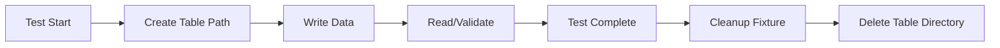
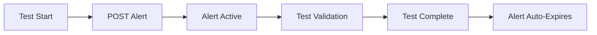

# Data Model: Test Infrastructure Enhancement

**Feature**: Test Infrastructure Enhancement
**Date**: 2025-10-29
**Branch**: `001-test-infrastructure`

## Overview

This feature is **infrastructure-only** and does not introduce new application data models. The infrastructure components (Spark, AlertManager) operate on existing CDC data models and test data.

---

## Infrastructure Entities

### Delta Table

**Description**: Versioned data lake table managed by Delta Lake with transaction log

**Storage Location**: `/opt/delta-tables/test_{uuid}/`

**Structure**:
```
delta_table/
├── _delta_log/              # Transaction log directory
│   ├── 00000000000000000000.json    # Initial commit
│   ├── 00000000000000000001.json    # Subsequent commits
│   └── _last_checkpoint               # Checkpoint metadata
└── part-*.parquet           # Data files
```

**Metadata**:
- Version: Integer (incremental)
- Timestamp: ISO 8601 datetime
- Operation: String (WRITE, MERGE, DELETE, UPDATE)
- Schema: Spark StructType
- Partition columns: Optional list
- Configuration: Map<String, String>

**Validation Rules**:
- Table path must be writable
- Transaction log must be consistent (no gaps in versions)
- Parquet files must match schema
- CDF must be enabled for CDC tests

**State Transitions**:
```
Created → Data Written → CDF Enabled → Read/Queried → Deleted (cleanup)
```

**Test Usage**:
- Unit tests create temporary tables
- Integration tests validate CDC capture
- Cleanup fixtures remove after test completion

---

### Alert

**Description**: Alert event managed by AlertManager

**API Representation** (JSON):
```json
{
  "labels": {
    "alertname": "TestAlert",
    "severity": "info|warning|critical",
    "environment": "test",
    "component": "string"
  },
  "annotations": {
    "summary": "string",
    "description": "string"
  },
  "startsAt": "2025-10-29T12:00:00.000Z",
  "endsAt": "2025-10-29T13:00:00.000Z",
  "status": {
    "state": "active|suppressed|unprocessed"
  }
}
```

**Validation Rules**:
- `alertname` is required
- `environment: test` required for all test alerts
- `startsAt` must be ISO 8601 datetime
- `endsAt` must be after `startsAt` (if present)
- `severity` must be one of: info, warning, critical

**State Transitions**:
```
unprocessed → active → [suppressed (if silenced)] → resolved → deleted
```

**Test Usage**:
- Tests POST alerts to AlertManager API
- Tests verify alert routing and grouping
- Cleanup fixtures delete test alerts after test

---

### Silence

**Description**: Alert suppression rule managed by AlertManager

**API Representation** (JSON):
```json
{
  "id": "uuid-string",
  "matchers": [
    {
      "name": "alertname",
      "value": "TestAlert",
      "isRegex": false
    }
  ],
  "startsAt": "2025-10-29T12:00:00.000Z",
  "endsAt": "2025-10-29T13:00:00.000Z",
  "createdBy": "pytest",
  "comment": "Test silence for integration testing",
  "status": {
    "state": "active|expired|pending"
  }
}
```

**Validation Rules**:
- At least one matcher required
- `startsAt` and `endsAt` required
- `createdBy` and `comment` required
- Matchers must reference valid label names

**State Transitions**:
```
pending → active → expired → deleted
```

**Test Usage**:
- Tests create silences to verify alert suppression
- Tests validate silence matching logic
- Cleanup fixtures delete silences after test

---

## Test Data Models

### Test Alert Fixture Data

**Purpose**: Standardized alert data for repeatable tests

**Example**:
```python
TEST_ALERT_TEMPLATE = {
    "labels": {
        "alertname": "TestAlert",
        "severity": "info",
        "environment": "test",
        "component": "pytest"
    },
    "annotations": {
        "summary": "Test alert for integration testing",
        "description": "This alert is generated by pytest"
    },
    "startsAt": current_timestamp()
}
```

**Variations**:
- `severity: critical` - for routing tests
- `environment: test` - always present for cleanup
- `component: {test_name}` - for test isolation

---

### Delta Table Test Schema

**Purpose**: Simple schema for Delta Lake write tests

**Spark Schema**:
```python
from pyspark.sql.types import StructType, StructField, IntegerType, StringType, TimestampType

TEST_SCHEMA = StructType([
    StructField("id", IntegerType(), False),
    StructField("name", StringType(), True),
    StructField("value", IntegerType(), True),
    StructField("timestamp", TimestampType(), True)
])
```

**Test Data**:
```python
TEST_DATA = [
    (1, "test_record_1", 100, datetime.now()),
    (2, "test_record_2", 200, datetime.now()),
    (3, "test_record_3", 300, datetime.now())
]
```

**Validation**:
- ID column is primary key (not null)
- Schema matches Delta table schema
- Row count matches expected count
- CDF captures all changes

---

## Configuration Models

### Spark Configuration

**File**: `configs/spark/spark-defaults.conf`

**Model**:
```python
SparkConfig = {
    "spark.sql.extensions": "io.delta.sql.DeltaSparkSessionExtension",
    "spark.sql.catalog.spark_catalog": "org.apache.spark.sql.delta.catalog.DeltaCatalog",
    "spark.jars.packages": "io.delta:delta-core_2.12:3.0.0",
    "spark.sql.warehouse.dir": "/opt/delta-tables",
    "spark.eventLog.enabled": "false"
}
```

**Validation**:
- All required extensions present
- Delta Lake version compatible with Spark version
- Warehouse directory writable

---

### AlertManager Configuration

**File**: `configs/alertmanager/alertmanager.yml`

**Model**:
```python
AlertManagerConfig = {
    "global": {
        "resolve_timeout": "5m"
    },
    "route": {
        "receiver": "test-receiver",
        "group_by": ["alertname", "severity"],
        "group_wait": "10s",
        "group_interval": "10s",
        "repeat_interval": "1h"
    },
    "receivers": [
        {
            "name": "test-receiver",
            "webhook_configs": [
                {
                    "url": "http://localhost:5001/webhook",
                    "send_resolved": True
                }
            ]
        }
    ]
}
```

**Validation**:
- At least one receiver defined
- Default route specified
- Webhook URLs reachable (or mock)

---

## Relationships

**No Complex Relationships** - Infrastructure entities are independent:
- Delta tables are isolated per test
- Alerts are independent events
- Silences reference alerts via label matchers (loose coupling)
- Spark sessions are ephemeral (test scope)

---

## Data Lifecycle

### Delta Table Lifecycle



**Retention**: Deleted after test completion (or persisted on failure for debugging)

---

### Alert Lifecycle



**Retention**: Auto-expires after `endsAt` timestamp (typically 5-10 minutes)

---

## Summary

This feature adds **infrastructure support** for existing data models:
- **No new application entities**
- **No database schema changes**
- **No persistent data models**

All data models are **test-scoped** and **ephemeral**:
- Delta tables cleaned up after tests
- Alerts expire automatically
- Silences deleted by fixtures
- Spark sessions closed after test session

The focus is on **enabling existing tests** to run against real infrastructure rather than mocks.
